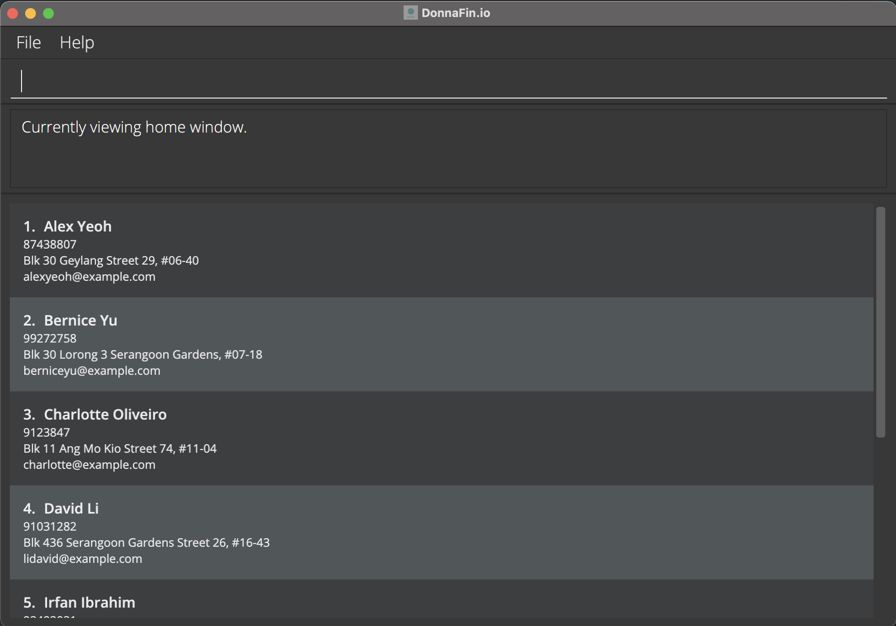

# DonnaFin.io

* This is **a project targeted towards financial advisors**. 

* The project simulates an ongoing software project for a desktop application (called _DonnaFin.io_) used for client management.
  * It is **written in OOP fashion**. It provides a **reasonably well-written** code base **bigger** (around 6 KLoC) than what students usually write in beginner-level SE modules, without being overwhelmingly big.
  * It comes with a **reasonable level of user and developer documentation**.
* This project is named `DonnaFin.io` (`DonnaFin` for short).
  * `Donna` is named after _Donna Paulsen_, the **amazing secretary** from _Suits_, whom this project aspires to emulate.
  * `Fin` stands for financial advisor, our target audience.
  * `.io` is a reflection of our belief that you deserve a faster workflow for input and output.
* For the detailed documentation of this project, see the **[DonnaFin Product Website](https://ay2122s1-cs2103t-w16-1.github.io/tp/)**.

_This project is based on the AddressBook-Level3 project created by the [SE-EDU initiative](https://se-education.org)._
