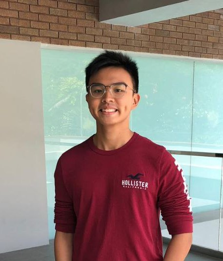

We are a team based in the [School of Computing, National University of Singapore](http://www.comp.nus.edu.sg).

You can reach us at the email `seer[at]comp.nus.edu.sg`

## Project team

### Tan Shee Hui

[[github](https://github.com/sheehui)]
[[portfolio](team/sheehui.md)]

* Role: Developer
* Responsibilities: Storage + Scheduling and Deliverables

### Bharath Chandra Sudheer

[[github](http://github.com/bharathcs)]
[[portfolio](team/bharathcs.md)]

* Role: Developer, Git Expert
* Responsibilities: Model layer, CI/CD, Code Quality

### Tee Chin

[[github](http://github.com/Bluntsord)]
[[portfolio](team/bluntsord.md)]

* Role: Developer, Architect, 
* Responsibilities: UI layer and commons, Architecture

### Jean Doe

[[github](http://github.com/johndoe)]
[[portfolio](team/johndoe.md)]

* Role: Developer
* Responsibilities: Dev Ops + Threading

### James Doe

[[github](http://github.com/johndoe)]
[[portfolio](team/johndoe.md)]

* Role: Developer
* Responsibilities: UI
