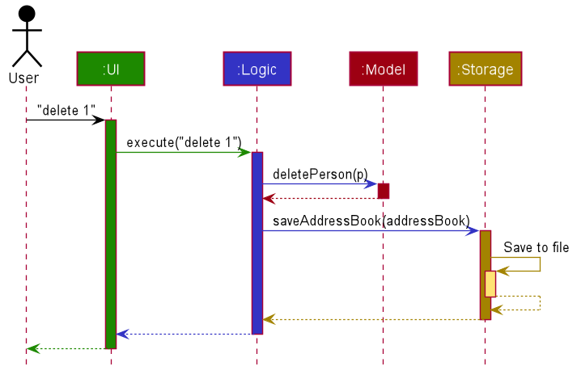

* Table of Contents
{:toc}

--------------------------------------------------------------------------------------------------------------------

## **Acknowledgements**

Code Reuse
* [SE-EDU: Address Book 3](https://github.com/se-edu/addressbook-level3/) - served as the foundation of this project
* [SE-EDU: Address Book 4](https://github.com/se-edu/addressbook-level4/) - adapted their automated GUI tests for use here.

Libraries / Framework
* [JavaFX](https://github.com/openjdk/jfx) - front-end Java framework
* [ShadowJAR](https://github.com/johnrengelman/shadow) - generating fat JARs
* [Jackson](https://github.com/FasterXML/jackson) - file parsing framework for `.json`
* [JUnit](https://junit.org/) - testing framework
* [TestFX](https://testfx.github.io/TestFX/) - automated GUI testing framework

--------------------------------------------------------------------------------------------------------------------

## **Setting up, getting started**

Refer to the guide [_Setting up and getting started_](SettingUp.md).

--------------------------------------------------------------------------------------------------------------------

## **Design**

:bulb: **Tip:** The `.puml` files used to create diagrams in this document can be found in the [diagrams](https://github.com/se-edu/addressbook-level3/tree/master/docs/diagrams/) folder. Refer to the [_PlantUML Tutorial_ at se-edu/guides](https://se-education.org/guides/tutorials/plantUml.html) to learn how to create and edit diagrams.

### Architecture

The ***Architecture Diagram*** given above explains the high-level design of the App.

Given below is a quick overview of main components and how they interact with each other.

**Main components of the architecture**

**`Main`** has two classes called [`Main`](https://github.com/se-edu/addressbook-level3/tree/master/src/main/java/seedu/address/Main.java) and [`MainApp`](https://github.com/se-edu/addressbook-level3/tree/master/src/main/java/seedu/address/MainApp.java). It is responsible for,
* At app launch: Initializes the components in the correct sequence, and connects them up with each other.
* At shut down: Shuts down the components and invokes cleanup methods where necessary.

[**`Commons`**](#common-classes) represents a collection of classes used by multiple other components.

The rest of the App consists of four components.

* [**`UI`**](#ui-component): The UI of the App.
* [**`Logic`**](#logic-component): The command executor.
* [**`Model`**](#model-component): Holds the data of the App in memory.
* [**`Storage`**](#storage-component): Reads data from, and writes data to, the hard disk.

**How the architecture components interact with each other**

The *Sequence Diagram* below shows how the components interact with each other for the scenario where the user issues the command `delete 1`.

Here is an explanation of what takes place when the user enters the command `delete 1`
* The `UI` takes in the command inputted from the user and passes it to the `Logic` component that is responsible for parsing the input.
* The `Logic` component parses the command and the `deletePerson` method is called which engages the `Model` component.
* The `Model` component then deletes the `Person` object p from the `addressBook`.
* The `Logic` component then calls the `saveAddressBook` method to save the updated `addressBook` with the deleted person.
* The `Model` component then calls `saveAddressBook` method that engages the `Storage` component to save the updated changes to storage locally.

Each of the four main components (also shown in the diagram above),

* defines its *API* in an `interface` with the same name as the Component.
* implements its functionality using a concrete `{Component Name}Manager` class (which follows the corresponding API `interface` mentioned in the previous point.

For example, the `Logic` component defines its API in the `Logic.java` interface and implements its functionality using the `LogicManager.java` class which follows the `Logic` interface. Other components interact with a given component through its interface rather than the concrete class (reason: to prevent outside component's being coupled to the implementation of a component), as illustrated in the (partial) class diagram below.

The sections below give more details of each component.

### UI component

[`Ui.java`](https://github.com/se-edu/addressbook-level3/tree/master/src/main/java/seedu/address/ui/Ui.java) specifies the API of this component.

The UI consists of a `MainWindow` that is made up of parts e.g.`CommandBox`, `ResultDisplay`, `PersonListPanel`, `ClientInfoPanel` etc. All these, including the `MainWindow`, inherit from the abstract `UiPart` class which captures the commonalities between classes that represent parts of the visible GUI.

The `UI` component uses the JavaFx UI framework. The layout of these UI parts are defined in matching `.fxml` files that are in the `src/main/resources/view` folder. For example, the layout of the [`MainWindow`](https://github.com/se-edu/addressbook-level3/tree/master/src/main/java/seedu/address/ui/MainWindow.java) is specified in [`MainWindow.fxml`](https://github.com/se-edu/addressbook-level3/tree/master/src/main/resources/view/MainWindow.fxml)

The `UI` component,

* executes user commands using the `Logic` component.
* listens for changes to `Model` data so that the UI can be updated with the modified data.
* keeps a reference to the `Logic` component, because the `UI` relies on the `Logic` to execute commands.
* depends on some classes in the `Model` component, as it displays `Person` object residing in the `Model`.

### Logic component

**API** : [`Logic.java`](https://github.com/se-edu/addressbook-level3/tree/master/src/main/java/seedu/address/logic/Logic.java)

Here's a (partial) class diagram of the `Logic` component:

How the `Logic` component works:
1. When `Logic` is called upon to execute a command, it chooses an `ABCParser` class e.g `AddressBookParser`, `ContactTabParser` etc., 
to parse the user command.
2. This results in a `Command` object (more precisely, an object of one of its subclasses e.g., `AddCommand`) which is executed by the `LogicManager`.
3. The command can communicate with the `Model` when it is executed (e.g. to add a person).
4. The result of the command execution is encapsulated as a `CommandResult` object which is returned back from `Logic`.

The Sequence Diagram below illustrates the interactions within the `Logic` component for the `execute("delete 1")` API call.

:information_source: **Note:** The lifeline for `DeleteCommandParser` should end at the destroy marker (X) but due to a limitation of PlantUML, the lifeline reaches the end of diagram.

Here are the other classes in `Logic` (omitted from the class diagram above) that are used for parsing a user command:

How the parsing works:
* ParserContext holds a reference to a ParserStrategy that is set based on the current tab the user is on etc
* When ParserContext calls upon the current ParserStrategy to parse a user command, the `ABCParser` (`ABC` is a placeholder for the specific parser strategy e.g.,`ContactTabParser`) creates an `XYZCommandParser` (`XYZ` is a placeholder for the specific command name e.g., `AddCommandParser`) which uses the other classes shown above to parse the user command and create a `XYZCommand` object (e.g., `AddCommand`) which the `AddressBookParser` returns back as a `Command` object.
* All `XYZCommandParser` classes (e.g., `AddCommandParser`, `DeleteCommandParser`, ...) inherit from the `Parser` abstract class so that they can be treated similarly where possible e.g, during testing.
* ClientViewParser and AddressBookParser inherit from ParserStrategy while the tab specific parsers inherit from ClientViewParser inherit.

How the `ABCParser` in ParserContext is updated:
1. When a `XYZCommand` class (e.g. `HomeCommand`, `ViewCommand`,...) is executed, it returns a `CommandResult` object containing a logic action if the `XYZCommand` requires a change in tab or view.
2. `LogicManager` accepts this `CommandResult` object and executes the logic action if present. LogicManager is a facade that is able to set and change the current ParserStrategy.
3. `ParserContext` in `LogicManager` is updated to contain the `ABCParser` of the new view or tab.

There is also another noteworthy Logic class, `PersonAdapter`, that serves as a wrapper for the Model class `Person`.
The key differences are that `Person` is immutable and does not support edits, while the `PersonAdapter` effectively supports edits by wrapping a single `Person` object and replacing it with an edited copy as and when necessary.
Such an implementation supports the user viewing and controlling a single client like with the `ViewCommand`.

### Model component
**API** : [`Model.java`](https://github.com/se-edu/addressbook-level3/tree/master/src/main/java/seedu/address/model/Model.java)

The `Model` component,

* stores the address book data i.e., all `Person` objects (which are contained in a `UniquePersonList` object).
* stores the currently 'selected' `Person` objects (e.g., results of a search query) as a separate _filtered_ list which is exposed to outsiders as an unmodifiable `ObservableList<Person>` that can be 'observed' e.g. the UI can be bound to this list so that the UI automatically updates when the data in the list change.
* stores a `UserPref` object that represents the user’s preferences. This is exposed to the outside as a `ReadOnlyUserPref` objects.
* stores `Storage` object and communicates with it to save address book to user files.

### Storage component

**API** : [`Storage.java`](https://github.com/se-edu/addressbook-level3/tree/master/src/main/java/seedu/address/storage/Storage.java)

The `Storage` component,
* can save both address book data and user preference data in json format, and read them back into corresponding objects.
* inherits from both `AddressBookStorage` and `UserPrefStorage`, which means it can be treated as either one (if only the functionality of only one is needed).
* depends on some classes in the `Model` component (because the `Storage` component's job is to save/retrieve objects that belong to the `Model`)

### Common classes

Classes used by multiple components are in the `donnafin.commons` package.

--------------------------------------------------------------------------------------------------------------------

## **Documentation, logging, testing, configuration, dev-ops**

* [Documentation guide](Documentation.md)
* [Testing guide](Testing.md)
* [Logging guide](Logging.md)
* [Configuration guide](Configuration.md)
* [DevOps guide](DevOps.md)

--------------------------------------------------------------------------------------------------------------------

## **Appendix: Requirements**

### Product scope

**Target user profile**:

* Financial Advisor
* Has a need to manage a significant number of clients
  * Keep track of their financial and personal information
* Prefer desktop apps over other types
* Tech-savvy, comfortable with keyboard shortcuts (CLI apps)
* Can type fast
* Prefers typing to mouse interactions

**Value proposition**: manage customers faster than a typical mouse/GUI driven app

The product provides financial advisors with a clean, easy to use interface to prepare
them for meetings and maintain good relationships with their clients. On a per-client basis,
DonnaFin keeps track and displays client’s financial details, their contact details, and
any notes about the client. In the main page, it collates all clients for easy access. In the
client information page, financial details of the specific client selected is neatly segmented into 
tabs for convenient and quick access.

The product will not help them with work relations with other Financial Advisors as the
product’s scope only covers the personal use of the product. It does not link with any
financial calculators, financial databases or cover market information.

### User stories

Priorities: High (must have) - `* * *`, Medium (nice to have) - `* *`, Low (unlikely to have) - `*`

| Priority | As a …​                                  | I want to …​               | So that I can…​                                                     |
| -------- | ------------------------------------------ | ------------------------------ | ---------------------------------------------------------------------- |
| `HIGH`  | new user                                   | see usage instructions         | refer to instructions when I forget how to use the App                 |
| `HIGH`  | user                                       | add a new client               | add new clients to my list                                             |
| `HIGH`  | user                                       | delete a client                | remove clients that I no longer have                                   |
| `HIGH`  | efficient user                                       | find a client by name          | locate details of clients without having to go through the entire list |
| `HIGH`  | user                                       | view a client's personal info  | find out the personal information about the client |
| `HIGH`  | user                                       |  return to home view from client's information | move on to view my other clients instead of the current client that I am viewing |
| `HIGH`  | new user                                       | clear all clients   | delete all clients and reset all my contacts for the application |
| `HIGH`  |  user                                      |  edit a client's contact information  |  keep up to date with the clients information for further usage|
| `HIGH`  |  user                                      |  add a policy to the client's list of policies |  update the current policies the client has should a new policy be purchased| 
| `HIGH`  |  user                                      |  delete a policy to the client's list of policies |  update the current policies the client has |  
| `HIGH`  |  user                                      |  add an asset to the client's  list of assets |   update the current assets the client has|  
| `HIGH`  |  user                                      |  delete an asset from the client's list of assets |   update the current assets the client has|  
| `HIGH`  |  efficient user                                      |   view the total value of all assets |   make decisions regarding the assets and inform the client about his aggregated asset value easily|  
| `HIGH`  |   user                                      |    add a liability to the client's list of liabilities | update the current liabilities that the client has   |   
| `HIGH`  |   user                                      |    delete a liability from the client's list of liabilities | update the current liabilities that the client has   |   
| `HIGH`  |  efficient user                                      |   view the total value of liabilities |   make decisions regarding liabilities with more useful information |  
| `HIGH`  |  user                                       |  jot down quick notes regarding the client | keep track of general information regarding the client |
| `HIGH`  | organised user                                       | switch between different tabs of client information, e.g financial information or personal information | have access to all the information of the client easily |
| `LOW`      | new user                                   | follow a tutorial when adding my first client | learn how to add a new client                           |
| `LOW`      | new user                                   | follow a tutorial when deleting a client       | learn how to remove a client that I do not want to keep track of    |
| `LOW`      | new user                                   | follow a tutorial to view a client's personal information      |  learn how to view a specific client's contact information   |
| `LOW`      | new user                                   |  follow a tutorial to switch between a client's information information tabs |   learn how to view all information regarding a specific client   |
| `LOW`      | new user                                   | follow a tutorial when adding policies to a client's list of policies       |  learn how to add policies to the list of policies of a specific client   |
| `LOW`      | new user                                   | follow a tutorial when deleting policies from a client's list of policies       |  learn how to delete policies from the list of policies of a specific client   |
| `LOW`      | new user                                   | follow a tutorial when adding assets to a client's list of assets      |   learn how to add assets to the list of assets of a specific client  |
| `LOW`      | new user                                   | follow a tutorial when adding delete from a client's list of asssets   |   learn how to delete assets from the list of assets of a specific client  |
| `LOW`      | new user                                   | follow a tutorial when adding liabilities to a client's list of liabilities      |   learn how to add liabilities to the list of liabilities of a specific client  |
| `LOW`      | new user                                   | follow a tutorial when deleting liabilities from a client's list of liabilities      |   learn how to delete liabilities from the list of liabilities of a specific client  |
| `LOW`      | new user                                   | follow a tutorial when jotting down notes for a client |   learn how to jot down quick notes regarding general information of the client |

### Use cases

(For all use cases below, the **System** is the `DonnaFin` application and the **Actor** is the `user`, unless specified otherwise)

**UC01: Adding a client to DonnaFin** \
State: Home view

**MSS**

1.  User requests to add client along with the relevant details.
2.  DonnaFin announces that the client has been successfully added.\
    Use Case ends.

**Extensions**
* 1a. The user types the command using the wrong syntax.
  * 1a1. DonnaFin shows an error message and displays the correct format for the user to use and a correct example.\
         Use Case resumes from step 1.

**UC02: Deleting a client from DonnaFin** \
State: Home view

**MSS**

1. User requests to delete a client from DonnaFin using the right syntax.
2. DonnaFin announces that the client has been successfully deleted.\
Use case ends.

**Extensions**

* 1a. The given index is invalid.

    * 1a1. DonnaFin shows an error message.
  
      Use case resumes from step 1.

**UC03: Finding a client by name** \
State: Home view

**MSS**
1. User chooses to find a client within DonnaFin using the right syntax.
2. DonnaFin displays the clients that match the keyword inputted.

**Extensions**
* 1a. The user types the command using the wrong syntax.
  * 1a1. DonnaFin shows an error message.\
         Use Case resumes at step 1.
* 1b. The keyword does not match any client.
  * 1b1. DonnaFin does not display any client.\
         Use Case ends.

**UC04: Viewing the details of a client** \
State: Home view

**MSS**
1. User requests to view a client using the right syntax.
2. DonnaFin displays details on the client.

**Extensions**
* 1a. The user types the command using the wrong syntax.
    * 1a1. DonnaFin shows an error message.\
      Use Case resumes at step 1.
* 1b. The given index is invalid.
    * 1b1. DonnaFin shows an error message.\
      Use Case resumes at step 1.

**UC05: Getting help** \
State: Works on both Home and Client view

**MSS**
1. User requests for help to get assistance on commands.
2. DonnaFin displays a window with the user guide for the DonnaFin application.

**UC06: Listing all clients** \
State: Home View

**MSS**
1. User requests for the list of all the registered clients.
2. DonnaFin displays all the clients that has been registered within DonnaFin.

**UC07: Exiting the application** \
State: Works on both Home and Client view

**MSS**
1. User requests to exit the application.
2. DonnaFin closes itself.

**UC08: Switching to other tabs** \
State: Client view

**MSS**
1. User requests to view another tab within the client view.
2. DonnaFin switches the current tab to the requested tab.

**Extensions**
* 1a. The user types the wrong command.
  * 1a1. DonnaFin shows an error message. \
         Use case resumes at step 1.
* 1b. The user types the wrong tab title.
  * 1b1. DonnaFin shows an error message and tells the user that the tab they request does not match any existing tab. \
         Use case resumes at step 1.

**UC09: Returning to Home View**
State: Client view

**MSS**

1. User requests to return to home view.
2. DonnaFin switches the view back to Home view.

**Extensions**

* 1a. The user types the wrong command.
  * 1a1. DonnaFin shows an error message. \
        Use case resumes at step 1.

**UC10: Editing a client's contact information**
State: Client view (Contact Tab)

**MSS**

1. User requests to edit client's contact information
2. Field is edited and client view with the updated field is shown

**Extensions**

* 1a. The user types the wrong command.
    * 1a1. DonnaFin shows an error message. \
      Use case resumes at step 1.
* 1b. The user types in the new field with the unsupported format.
    * 1b1. Contact is not updated and DonnaFin shows an error message. \
      Use case resumes at step 1.

### Non-Functional Requirements

1.  Should work on any _mainstream OS_ as long as it has Java `11` or above installed.
2.  Should be able to hold up to 1000 persons without a noticeable sluggishness in performance for typical usage.
3.  A user with above average typing speed for regular English text (i.e. not code, not system admin commands) should be able to accomplish most of the tasks faster using commands than using the mouse.
4.  A novice with no coding background should be able to use the address book.
5.  The system should respond within 100 milliseconds.
6.  The size of the application should be no more than 100 MB.
7.  All data should be stored locally.
8.  The application should not need a remote server to function.
9.  The application should not require any installer to start functioning.
10. The GUI should appear fine for screen resolutions 1920x1080 and higher.

### Glossary

* **Mainstream OS**: Windows, Linux, Unix, OS-X
* **Private client detail**: A client detail that is not meant to be shared with others

--------------------------------------------------------------------------------------------------------------------

## **Appendix: Instructions for manual testing**

Given below are instructions to test the app manually.

:information_source: **Note:** These instructions only provide a starting point for testers to work on;
testers are expected to do more *exploratory* testing.

### Launch and shutdown

1. Initial launch

   1. Download the jar file and copy into an empty folder

   1. Double-click the jar file Expected: Shows the GUI with a set of sample clients. The window size may not be optimum.

1. Saving window preferences

   1. Resize the window to an optimum size. Move the window to a different location. Close the window.

   1. Re-launch the app by double-clicking the jar file. 
       Expected: The most recent window size and location is retained.

1. _{ more test cases …​ }_

### Deleting a person

1. Deleting a person while all persons are being shown

   1. Prerequisites: List all persons using the `list` command. Multiple persons in the list.

   1. Test case: `delete 1` 
      Expected: First client is deleted from the list. Details of the deleted client shown in the status message. Timestamp in the status bar is updated.

   1. Test case: `delete 0` 
      Expected: No person is deleted. Error details shown in the status message. Status bar remains the same.

   1. Other incorrect delete commands to try: `delete`, `delete x`, `...` (where x is larger than the list size) 
      Expected: Similar to previous.

1. _{ more test cases …​ }_

### Saving data

1. Dealing with missing/corrupted data files

   1. _{explain how to simulate a missing/corrupted file, and the expected behavior}_

1. _{ more test cases …​ }_
