* Table of Contents
{:toc}

--------------------------------------------------------------------------------------------------------------------
<div style="page-break-after: always"></div>

## 1. Introduction

### 1.1 Purpose

This guide covers the architecture, implementation and design choices in DonnaFin to give the reader a clear picture
of the technical details, and the inner workings of DonnaFin.io (referred to as DonnaFin in this document for brevity).

### 1.2 Target Audience

* Developers: anyone who wishes to dive into this codebase to improve or extend on DonnaFin.
* Advanced Users: financial advisors who want to better understand DonnaFin's features.

### 1.3 About DonnaFin

DonnaFin.io is a desktop application for financial advisors to keep track of their client information and related tasks.
Despite the application having an intuitive Graphical User Interface (GUI), it is optimized for entering commands using
a Command Line Interface (CLI).

### 1.4 Typical User Workflow


This activity diagram shows how one might typically navigate through the DonnaFin application.

Commands refer to the pre-defined functions available to the user. Invalid commands refer to commands that are not
available in the current window or commands that are used with the wrong format.

### 1.5 Overview of Application
In order to better understand how DonnaFin helps financial advisors, it is useful to understand and model the
key client details that a financial advisor has to keep track of.

Below is an Object-Oriented Domain Model (OODM) modelling the existing state of affairs between a financial advisor and
their client/s.

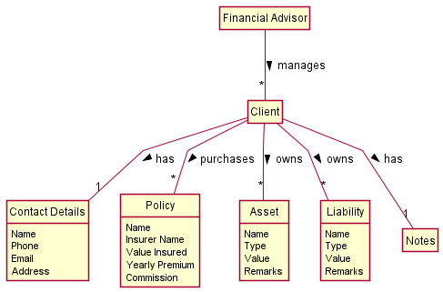

DonnaFin gives financial advisors a platform to store their numerous clients and their details. In this guide
it will be explained how all the different classes, and components of DonnaFin come together to create a software that
is able to perform this functionality.


--------------------------------------------------------------------------------------------------------------------


## 2. Acknowledgements

Code Reuse
* [SE-EDU: Address Book 3](https://github.com/se-edu/addressbook-level3/) - served as the foundation of this project
* [SE-EDU: Address Book 4](https://github.com/se-edu/addressbook-level4/) - adapted their automated GUI tests for use here.

Libraries / Framework
* [JavaFX](https://github.com/openjdk/jfx) - front-end Java framework
* [ShadowJAR](https://github.com/johnrengelman/shadow) - generating fat JARs
* [Jackson](https://github.com/FasterXML/jackson) - file parsing framework for `.json`
* [JUnit](https://junit.org/) - testing framework
* [TestFX](https://testfx.github.io/TestFX/) - automated GUI testing framework

--------------------------------------------------------------------------------------------------------------------

## 3. Setting up, getting started

Refer to the guide [_Setting up and getting started_](SettingUp.md).

--------------------------------------------------------------------------------------------------------------------

## 4. Design and Implementation

<div markdown="span" class="alert alert-primary">

:bulb: **Tip:** The `.puml` files used to create diagrams in this document can be found in the
[diagrams](https://github.com/ay2122S1-CS2103T-W16-1/tp/tree/master/docs/diagrams/) folder. Refer to the
[_PlantUML Tutorial_ at se-edu/guides](https://se-education.org/guides/tutorials/plantUml.html) to learn how to create
and edit diagrams.
</div>

### 4.1 Architecture

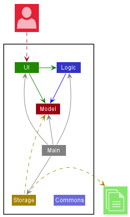

The ***Architecture Diagram*** given above explains the high-level design of the App.

Given below is a quick overview of main components and how they interact with each other.

**Main components of the architecture**

**`Main`** has two classes called [`Main`](https://github.com/AY2122S1-CS2103T-W16-1/tp/blob/master/src/main/java/donnafin/Main.java) and [`MainApp`](https://github.com/AY2122S1-CS2103T-W16-1/tp/blob/master/src/main/java/donnafin/MainApp.java). It is responsible for,
* At app launch: Initializes the components in the correct sequence, and connects them with each other.
* At shut down: Shuts down the components and invokes cleanup methods where necessary.

[**`Commons`**](#415-common-classes) represents a collection of classes used by multiple other components.

The rest of the App consists of four components.

* [**`Ui`**](#411-ui-component): The UI of the App.
* [**`Logic`**](#412-logic-component): The command executor.
* [**`Model`**](#413-model-component): Holds the data of the App in memory.
* [**`Storage`**](#414-storage-component): Reads data from, and writes data to, the hard disk.


Each of the four main components (also shown in the diagram above).
* defines its *API* in an `interface` with the same name as the Component.
* implements the aforementioned functionality using a concrete `{Component Name}Manager` class.

For example, the `Logic` component defines its API in the `Logic.java` interface and implements its functionality using
the `LogicManager.java`. Other components interact with a given component through its interface as much as possible
rather than the concrete class or through any lower-level class, as illustrated in the (partial) class diagram below.
Experienced programmers may recognise this as the Facade design pattern. (See: [Facade Design Pattern](https://refactoring.guru/design-patterns/facade))

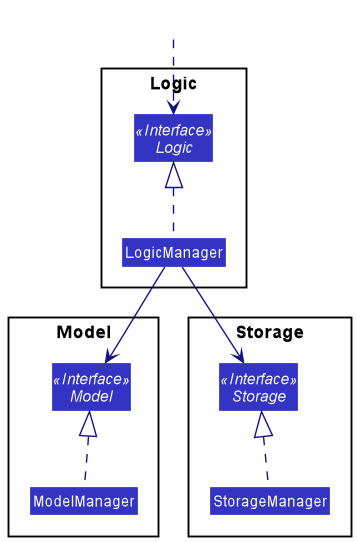

The sections below give more details of each component.

<div markdown="span" class="alert alert-primary">

:bulb: **Tip:** There are some notable exceptions to the `Facade` pattern. For example, for the `Ui` component,
`AttributePanel`, `PersonCard` and `ClientPanel`. Arguably the better implementation would be to restrict all the
interactions between components to the facades, but a design decision was made to prioritize a simple implementation of
critical features over adhering to the design pattern.
</div>


#### 4.1.1 UI component

[`Ui.java`](https://github.com/AY2122S1-CS2103T-W16-1/tp/blob/master/src/main/java/donnafin/ui/Ui.java) specifies the API of this component.

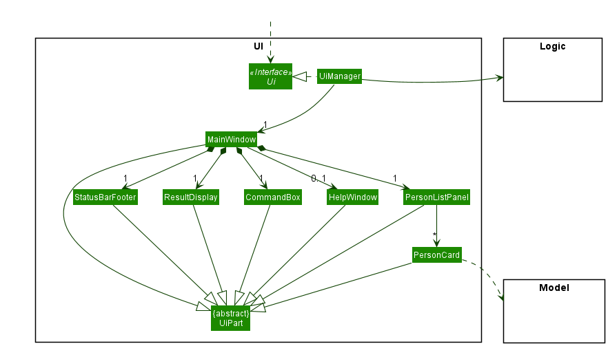

The UI consists of a `MainWindow` that is made up of parts e.g.`CommandBox`, `ResultDisplay`, `PersonListPanel` in
home view and `CommandBox`, `ResultDisplay`, and `ClientPanel` in client view. All these,
including the `MainWindow`, inherit from the abstract `UiPart` class which captures the commonalities between
classes that represent parts of the visible GUI.

The UI that is displayed has 6 main states to switch between.
 1. `PERSON_LIST_PANEL`
 2. `CONTACT`
 3. `POLICIES`
 4. `ASSETS`
 5. `LIABILITIES`
 6. `NOTES`

 The first state, `PERSON_LIST_PANEL` represents the home view of the client. It is where the user sees the information of multiple clients at the same time. The other 5 are tabs specific to
each client and will thus display different information for each client. The `Ui` keeps track of the current tab it is
observing through the `UiState`, which is set on each tab switch command. Further details for the tab switch command can be found
[here](#423-ui-browsing-commands).

The `Ui` component uses the JavaFx UI framework. The layout of these UI parts are defined in matching `.fxml` files that
are in the `src/main/resources/view` folder. For example, the layout of the
[`MainWindow`](https://github.com/AY2122S1-CS2103T-W16-1/tp/tree/master/src/main/java/donnafin/ui/MainWindow.java) is
specified in [`MainWindow.fxml`](https://github.com/AY2122S1-CS2103T-W16-1/tp/tree/master/src/main/resources/view/MainWindow.fxml)

The `Ui` component,

* executes user commands using the `Logic` component.
* listens for changes to `Model` data so that the UI can be updated with the modified data.
* keeps a reference to the `Logic` component, because the `Ui` relies on the `Logic` to execute commands.
* depends on some classes in the `Model` component, as it displays `Person` object residing in the `Model`.

#### 4.1.2 Logic component

**API** : [`Logic.java`](https://github.com/AY2122S1-CS2103T-W16-1/tp/blob/master/src/main/java/donnafin/logic/Logic.java)

Here's a (partial) class diagram of the `Logic` component:

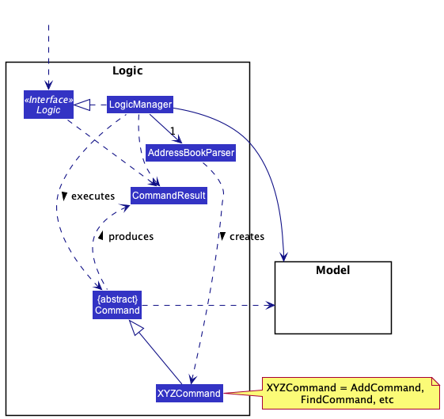

How the `Logic` component works:
1. When `Logic` is called upon to execute a command, it chooses an `ABCParser` class e.g `AddressBookParser`, `ContactTabParser` etc.,
to parse the user command.
2. This results in a `Command` object (more precisely, an object of one of its subclasses e.g., `AddCommand`) which is executed by the `LogicManager`.
3. The command can communicate with the `Model` when it is executed (e.g. to add a person).
4. The result of the command execution is encapsulated as a `CommandResult` object which is returned by `Logic`.

Here are the other classes in `Logic` (omitted from the class diagram above) that are used for parsing a user command:

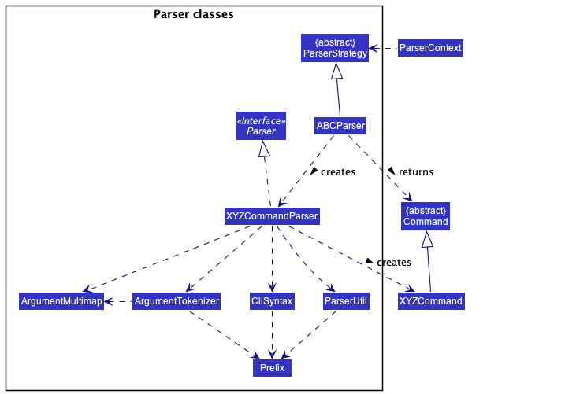

How the parsing works:
* `ParserContext` holds a reference to a `ParserStrategy` that is set based on the current tab the user is on etc.
* When `ParserContext` calls upon the current `ParserStrategy` to parse a user command,
the `ABCParser` (`ABC` is a placeholder for the specific parser strategy e.g.,`ContactTabParser`) creates
an `XYZCommandParser` (`XYZ` is a placeholder for the specific command name e.g., `AddCommandParser`) which uses the
other classes above to parse the user command and create a `XYZCommand` object. Further details can be seen in the
implementation of commands section [here](#42-implementation).


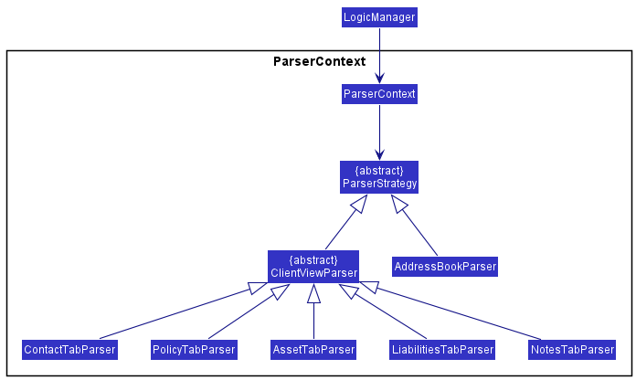
* All `XYZCommandParser` classes (e.g., `AddCommandParser`, `DeleteCommandParser`, ...) inherit from the `Parser` abstract class so that they can be treated similarly where possible e.g, during testing.
* `ClientViewParser` and `AddressBookParser` inherit from `ParserStrategy` while the tab specific parsers inherit from `ClientViewParser` inherit.


#### 4.1.3 Model component
**API** : [`Model.java`](https://github.com/AY2122S1-CS2103T-W16-1/tp/blob/master/src/main/java/donnafin/model/Model.java)

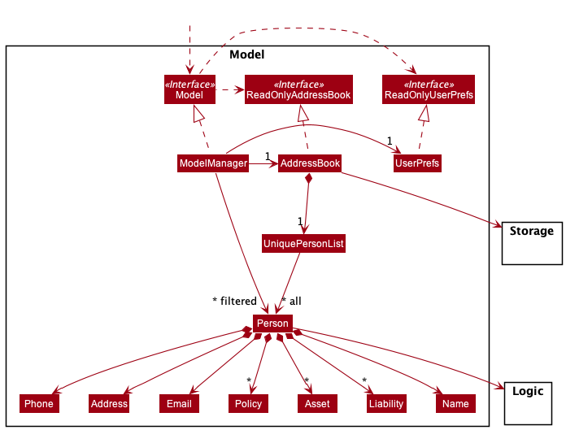


The `Model` component,

* stores the address book data i.e., all `Person` objects (which are contained in a `UniquePersonList` object).
* stores the currently 'selected' `Person` objects (e.g., results of a search query) as a separate _filtered_ list which is exposed to outsiders as an unmodifiable `ObservableList<Person>` that can be 'observed' e.g. the `Ui` can be bound to this list so that the `Ui` automatically updates when the data in the list change.
* stores a `UserPref` object that represents the user’s preferences. This is exposed to the outside as a `ReadOnlyUserPref` objects.
* stores `Storage` object and communicates with it to save address book to user files.

#### 4.1.4 Storage component

**API** : [`Storage.java`](https://github.com/AY2122S1-CS2103T-W16-1/tp/blob/master/src/main/java/donnafin/storage/Storage.java)

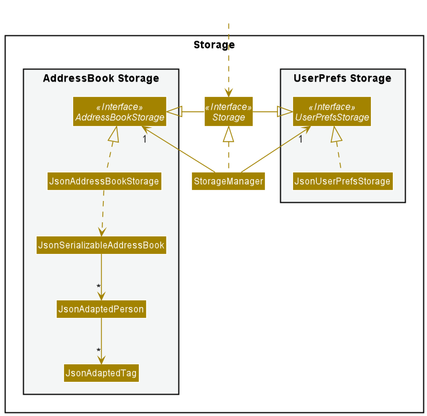

The `Storage` component,
* can save both address book data and user preference data in json format, and read them back into corresponding objects.
* inherits from both `AddressBookStorage` and `UserPrefStorage`, which means it can be treated as either one (if only the functionality of only one is needed).
* depends on some classes in the `Model` component (because the `Storage` component's job is to save/retrieve objects that belong to the `Model`)

How is `Person` stored?
* `JsonAdaptedPerson` is created with the Jackson framework.
* Each `Person` in DonnaFin is stored as a `JsonAdaptedPerson` as shown in our class diagram above.
* The `Name`, `Email`, `Phone`, `Address` and `Notes` of each `Person` is stored as a `JsonProperty` of type String.
* `Assets`, `Liabilities` and `Policy` are stored as a List of `JsonAdaptedAsset`, `JsonAdaptedLiability`
and `JsonAdaptedPolicy` respectively. Each `JsonAdaptedAsset`, `JsonAdaptedLiability`
and `JsonAdaptedPolicy` is created separately using Jackson and contains the necessary fields for their respective attributes,
stored as a `JsonProperty` of type String.
* As a `Person` can have more than one `Asset`, `Liability` or `Policy`, we have chosen to store them as nested objects rather
converting them into a single String before storage and converting them back to the correct attributes on retrieval from the database.
* As such, `Asset`, `Liability` and `Policy` are stored in this special manner and any future attributes that share the same characteristics
can be stored in the same way.

Here is an example of a `Person` in JSON form:
``` yaml
{
  "name" : "Alex Yeoh",
  "phone" : "87438807",
  "email" : "alexyeoh@example.com",
  "address" : "Blk 30 Geylang Street 29, #06-40",
  "notes" : "Likes bread",
  "policies" : [ {
    "name" : "Golden Age",
    "insurer" : "AIA",
    "totalValueInsured" : "$ 14000.00",
    "yearlyPremiums" : "$ 28.00",
    "commission" : "$ 4.00"
  } ],
  "liabilities" : [ {
    "name" : "Bank debt",
    "type" : "debt",
    "value" : "$ 20000.00",
    "remarks" : "10% interest"
  } ],
  "assets" : [ {
    "name" : "HDB @Jurong",
    "type" : "Property",
    "value" : "$ 300000.00",
    "remarks" : "BTO"
  } ]
}
```

#### 4.1.5 Common classes

Classes used by multiple components are in the `donnafin.commons` package.

There are three main groups of Common classes, and here is a brief description of each and examples of how they are used
in this codebase.

**Type classes**

There are two classes that can be found under`donnafin.commons.core.types`:
* `Index`: Abstracts away the difference between one-based index (display / user input) and zero-based index (native
  Java indexing of data structures). Serves to minimise programming errors, particularly those of the 'off-by-one' 
  category that can happen when dealing with these incompatible numbering styles.
* `Money`: Provides a numerically sound structure that can be used to represent monetary values with precision and
  support arithmetic operations without foregoing easy in built conversion to a human-readable format with the currency
  symbol ('$').

**Utility classes**
There are multiple classes in `donnafin.commons.core.util` that serve a variety of purpose. In general, they can be seen
as a common library of pure functions that can be used throughout the application to fulfil certain purposes. It reduces
on code duplication and improves the cohesion of our code. For example, we often do defensive programming checks to 
ensure that multiple objects are not null, and the `CollectionUtil` package has useful static functions that can be 
called on to do this.

**Exception classes**
There are custom-built exceptions `donnafin.commons.exception`, that are used throughout the code base. Some custom 
exceptions (like `ParseException`) are only used in certain packages, and are therefore can be found in those packages.
In this package, we currently have `DataConversionException` and `IllegalValueException`, both of which handle a very
common issue throughout the application of handling and reporting bad formats (syntax) or bad inputs (semantics).

### 4.2 Implementation

**How the architecture components interact with each other through commands**

Command types fall into three main categories.
1. Model-level commands
2. Client-level commands
3. UI-browsing commands

Despite falling under the three broad categories, the commands still have many similarities. Thus, we give an
in depth explanation of how the first category works. Subsequent explanation of commands from the other two categories will follow
the same framework but differ slightly.

#### 4.2.1 Model-level commands

<div markdown="span" class="alert alert-info">:information_source: **Key properties:**
<br>
1. The command interacts with model through an addition or deletion<br>
2. The command interacts with storage through an addition or deletion.<br>
3. The command does not access the inner details of clients but rather treat them as atomic.
<br>
<br>
Commands that fall under this category are :<br>
1. Add <br>
2. Delete <br>
3. Find <br>
4. List <br>
</div>

The `delete` command is one of the commands that fall under this category.
We will be using the `delete` command as the example to illustrate and explain all commands under this category.

| Full sequence diagram  |
|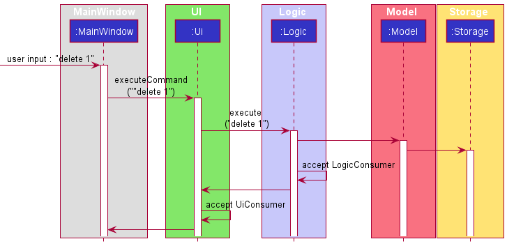 |
| Logic specific sequence diagram |
| |

Here is an explanation of what takes place when the user enters the command `delete 1` which falls under first [category](#42-implementation).
The full sequence diagram gives the overview of what happens when a command runs. Since the main legwork is done
in logic, the logic specific sequence diagram as shown above takes a deeper dive into the inner details the full
sequence diagram.

Explanation of diagram above:
* The `Ui` takes in the input command from the user and passes it to the `Logic` component.
* The `Logic` component parses the command and returns the `Delete` command.
* The `Logic` component executes the `Delete` command. The `deletePerson` method in `Model` is called which then deletes the `Person` from `donnafin.json`.
* The `Logic` component then accepts the `LogicConsumer` produced from the `CommandResult`. This consumer will alter the logic component depending on the `CommandResult`. In this case, for the `delete` command, the consumer makes no change to logic.
* The `Logic` component then continues with the `execute` command and calls the `saveAddressBook` method to save the updated `addressBook` with the deleted person.
This does not involve a consumer in any way and is always part of execute command.
* The `Model` component then calls `saveAddressBook` method that engages the `Storage` component to save the updated changes to storage locally.
* The `Ui` component then accepts the `Consumer<Ui>` produced from the `CommandResult`. This consumer will alter the UI component depending on the `CommandResult`. In this case, for the `delete` command, the consumer makes no change to logic.

#### 4.2.2 Client-level commands

<div markdown="span" class="alert alert-info">:information_source: **Key Properties:**
<br>
<br>
1. The command has to access and edit information regarding one specific client.<br>
2. The command interacts and actively updates information in storage.
<br>
However, commands in the third category differ from the first in that this category deals with information within one specific client,
while the first adds/deletes the client specified within the entire model.
<br>
<br>
Commands that fall into the second category are:<br>
1. Edit<br>
2. Append<br>
3. Remove<br>
</div>

`Edit` command is a command that edits the information of a specific client. Other commands like append and remove,
also deal directly with a specific client's information. Thus, they fall under the second [category](#42-implementation)
Like other commands in the other two [categories](#42-implementation), edit command follows the same general
structure. We will be using the `Edit` command as the example to illustrate and explain all commands under this category.

Explanation:
* The `Ui` takes in the input command from the user and passes it to the `Logic` component.
* The `Logic` component parses the input and the `Edit` command is returned. **A consumer for `PersonAdapter` is created here.**
* The `Logic` component executes the `Edit` command.
* During the execution of the `Edit` command above, the `PersonAdapter` accepts the consumer that edits
the specified person.
* A `EditCommandResult` is returned from the execution of `Edit` Command. This `CommandResult`,
like the two other [categories](#42-implementation) contain both a consumer for `Ui` and `Logic`.
* The `Logic` component then accepts the `LogicConsumer` produced from the `CommandResult`.
* The `Ui` component then accepts the `Consumer<Ui>` produced from the `CommandResult`. **The `Ui` is here to display the newly
edits made**.

<div markdown="span" class="alert alert-warning">**Explanation of PersonAdapter:**
<br>

In this category of commands, the class `PersonAdapter` is doing most of the legwork here.
`PersonAdapter` serves as a wrapper for the Model class `Person`.
The key differences are that `Person` is immutable and does not support edits, while the `PersonAdapter` effectively supports edits by wrapping a single `Person` object and replacing it with an edited copy as and when necessary.
Such an implementation supports the user viewing and controlling a single client like with the `ViewCommand`.
</div>

#### 4.2.3 UI-browsing commands

<div markdown="span" class="alert alert-info">:information_source: **Key Properties:**
<br>

1. The commands do not interact with model.<br>
2. The commands have to handle the changing of `ParserStrategy`, from the current one<br>
to `ABCParser` of the new tab.
3. The commands need to update the `UiState` of `Ui` to keep track of which tab the user is currently on.
<br>
<br>
Commands that fall into this category are:<br>
1. SwitchTab<br>
2. View<br>
3. Home<br>
</div>

Switch tab command is a command that explicitly involves the changing of tabs, which fall under the third [category](#42-implementation)
We will be using the `SwitchTab` command as the example to illustrate and explain all commands under this category.

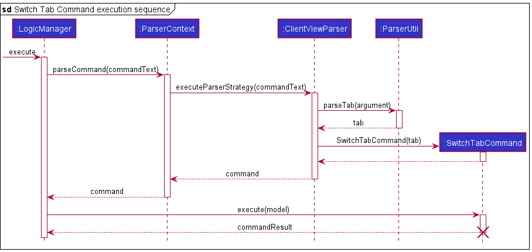

Explanation of diagram above:
* The `Ui` takes in the input command from the user and passes it to the `Logic` component that is responsible for parsing the input.
* The `Logic` component parses the command and returns the `SwitchTab` command.
* The `Logic` component executes the `SwitchTab` command and returns the `SwitchTabCommandResult`
* The `Logic` component then accepts the `LogicConsumer` produced from the `SwitchTabCommandResult`.
In this case, for the `SwitchTab` command, a new `ParserStrategy` is set here.
* The `Ui` component then accepts the `Consumer<Ui>` produced from the `CommandResult`. `UiState` is set here.


<div markdown="span" class="alert alert-warning">**Explanation of ParserContext:**
<br>

1. When a `XYZCommand` class (e.g. `HomeCommand`, `ViewCommand`,...) is executed, it returns a `CommandResult` object containing a logic action if the `XYZCommand` requires a change in tab or view. <br>
2. `LogicManager` accepts this `CommandResult` object and executes the logic action here.`LogicManager` is a facade that is able to set and change the current `ParserStrategy`.<br>
3. `ParserContext` in `LogicManager` is updated to contain the `ABCParser` of the new view or tab.<br>
4. `Ui` is updated to change its state, which is kept track of by `UiState` by accepting the consumer also in the `CommandResult`.<br>
</div>

#### 4.3 Contact Tab

The following screenshot shows the user in the Client View. You may notice that the primary controller for this view is
not the `MainWindow`, but a different class, `ClientPanel`. This JavaFX controller encapsulate all the logic for Client
View specific actions.

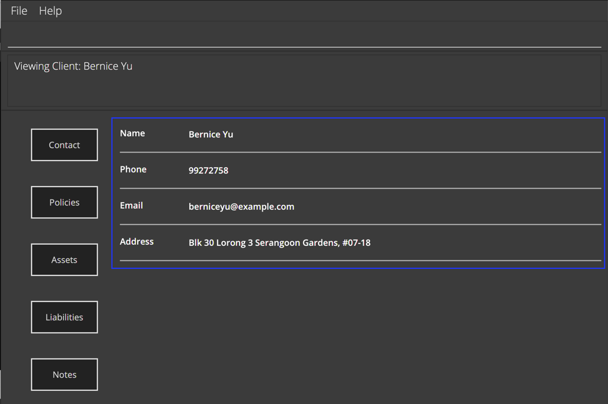

*The dark blue rectangle indicates a `VBox` (vertical box) containing 4 `AttributePanel` instances (1 for each attribute: `Name`, `Email`, `Phone`, `Address`.*

On every call to changing tab or refreshing, the `ClientPanel` takes the following steps:

1. The `VBox` container in `ClientPanel` will clear all its children 
1. `ClientPanel` will create a list of `AttributePanel`s (a handy class for constructing a display for any single valued attribute)
1. The `VBox` container will add the list of `AttributePanel`s as its child.

#### 4.4 Policies, Assets and Liabilities Tab

These tabs all behave and are implemented identically, so they will be discussed together, with the Policies tab used
as an example.

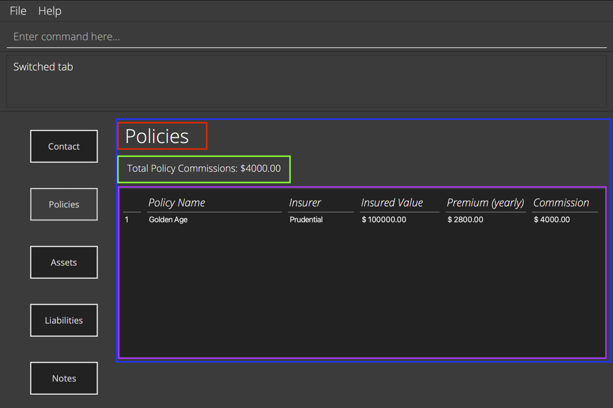

*The dark blue rectangle indicates an `AnchorPane` that contains the entire `AttributeTable`.*
*The red rectangle is the table heading.*
*The green rectangle is an 'aggregator' label, that shows some aggregated measurement of the data.*
*The purple rectangle is the standard JavaFX `TableView` component.*

`AttributeTable` is a generic class that aims to provide a standardised rich table view of any multi-valued attribute.
In aid of this, it was written as a generic class with the 'open-closed principle' in mind.
(See SE-EDU: [Open Closed Principle](https://nus-cs2103-ay2122s1.github.io/website/se-book-adapted/chapters/principles.html#open-closed-principle))
You can look at a very minimal example of how to create `TableConfig` and set up an attribute for `AttributeTable`
in [`AttributeTableTest`](../src/test/java/donnafin/ui/AttributeTableTest.java). In short, you have the `TableConfig`
holds the following:

* Table heading
* Aggregator function that takes a list of the attribute (`Policy` in this case) and turn it into an aggregate label
  (e.g. Total value of commissions)
* A list of `ColumnConfig` that specifies the property name, the column heading to show, the preferred and max widths
  for each column, as well.

The steps taken in constructing these tabs are very similar to those for the Contact tab.

1. The `VBox` container in `ClientPanel` will clear all its children.
1. The attribute intended to be used (policy in this case) will provide the `TableConfig` required as a public static member.
1. `ClientPanel` will create an `AttributeTable` using this configuration and the data (list of values from the `PersonAdapter`)
1. The `VBox` container will add the `AttributeTable` as its child.


**`AttributeTable`**

#### 4.5 Notes tab

The `NotesTabParser` is different from other `tabSpecificParsers` in that it has no tab specific command. However, the
`TextArea` of the notes tab allows the user to type in any quick notes that the
user would want, updating it in realtime. This is opposed to the commands however, since for commands
changes to any other component only happen when the command is executed. Hence, the notes tab takes advantage of a
different process.

This is a planned deviation in user workflow, and done so as notes are more infrequently used, and there is an expectation
that users would write at length in a multi-line field. As such, we deemed the gains from force fitting editing notes 
into a command line style  edit and accommodating a switch from the single line Command Bar was deemed unnecessarily 
complicated and unintuitive.

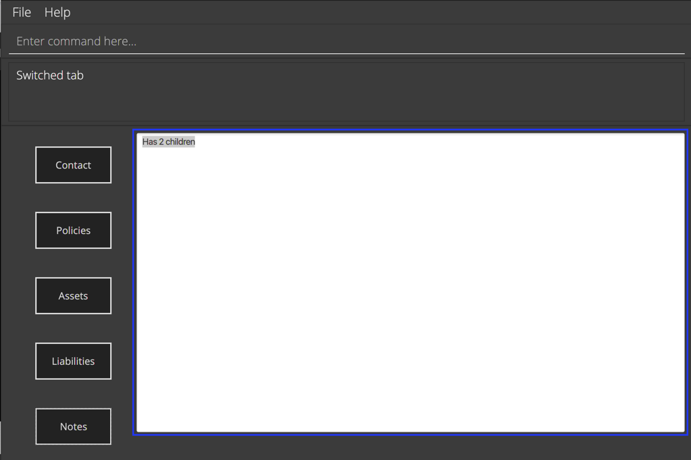

*The dark blue rectangle indicates an `TextArea`.*

1. The `VBox` container in `ClientPanel` will clear all its children.
1. `ClientPanel` will get the current value in the `PersonAdapter`'s notes field and create a `TextArea` with it.
1. The `TextArea` will be configured to support saving edits (explained later in this section).
1. The `VBox` container will add the `AttributeTable`s as its children.

Key details of the `TextArea`:
1. A listener is attached to the `TextArea` of the notes tab. This allows for realtime updates
   when typing in the `TextArea`. If there are any changes, the function `edit` in `PersonAdapter` is called.
2. The `edit` function in `PersonAdapter` saves the information straight away, hence making the updates realtime.

--------------------------------------------------------------------------------------------------------------------

## 5. Documentation, logging, testing, configuration, dev-ops

* [Documentation guide](Documentation.md)
* [Testing guide](Testing.md)
* [Logging guide](Logging.md)
* [Configuration guide](Configuration.md)
* [DevOps guide](DevOps.md)

--------------------------------------------------------------------------------------------------------------------

## 6. Appendix: Requirements

### 6.1 Product scope

**Target user profile**:

* Financial Advisor
* Has a need to manage a significant number of clients
  * Keep track of their financial and personal information
* Prefer desktop apps over other types
* Tech-savvy, comfortable with keyboard shortcuts (CLI apps)
* Can type fast
* Prefers typing to mouse interactions


**Value proposition**: manage customers faster than a typical mouse/GUI driven app

The product provides financial advisors with a clean, easy to use interface to prepare
them for meetings and maintain good relationships with their clients. On a per-client basis,
DonnaFin keeps track and displays client’s financial details, their contact details, and
any notes about the client. In the main page, it collates all clients for easy access. In the
client information page, financial details of the specific client selected is neatly segmented into
tabs for convenient and quick access.

The product will not help them with work relations with other financial advisors as the
product’s scope only covers the personal use of the product. It does not link with any
financial calculators, financial databases or cover market information.


### 6.2 User stories

Priorities: (must have) - `HIGH`, Medium (nice to have) - `MEDIUM`, Low (unlikely to have) - `LOW`

| Priority | As a …​                                  | I want to …​               | So that I can…​                                                     |
| -------- | ------------------------------------------ | ------------------------------ | ---------------------------------------------------------------------- |
| `HIGH`  | new user                                   | see usage instructions         | refer to instructions when I forget how to use the App                 |
| `HIGH`  | user                                       | add a new client               | add new clients to my list                                             |
| `HIGH`  | user                                       | delete a client                | remove clients that I no longer have                                   |
| `HIGH`  | efficient user                                       | find a client by name          | locate details of clients without having to go through the entire list |
| `HIGH`  | user                                       | view a client's personal info  | find out the personal information about the client |
| `HIGH`  | user                                       |  return to home window from client's information | move on to view my other clients instead of the current client that I am viewing |
| `HIGH`  | new user                                       | clear all clients   | delete all clients and reset all my contacts for the application |
| `HIGH`  |  user                                      |  edit a client's contact information  |  keep up to date with the clients information for further usage|
| `HIGH`  |  user                                      |  add a policy to the client's list of policies |  update the current policies the client has should a new policy be purchased|
| `HIGH`  |  user                                      |  delete a policy to the client's list of policies |  update the current policies the client has |
| `HIGH`  |  user                                      |  add an asset to the client's  list of assets |   update the current assets the client has|
| `HIGH`  |  user                                      |  delete an asset from the client's list of assets |   update the current assets the client has|
| `HIGH`  |  efficient user                                      |   view the total value of all assets |   make decisions regarding the assets and inform the client about his aggregated asset value easily|
| `HIGH`  |   user                                      |    add a liability to the client's list of liabilities | update the current liabilities that the client has   |
| `HIGH`  |   user                                      |    delete a liability from the client's list of liabilities | update the current liabilities that the client has   |
| `MEDIUM`  |  efficient user                                      |   view the total value of liabilities |   make decisions regarding liabilities with more useful information |
| `MEDIUM`  |  user                                       |  jot down quick notes regarding the client | keep track of general information regarding the client |
| `MEDIUM`  | organised user                                       | switch between different tabs of client information, e.g financial information or personal information | have access to all the information of the client easily |
| `MEDIUM`      | new user                                   | follow a tutorial when adding my first client | learn how to add a new client                           |
| `MEDIUM`      | new user                                   | follow a tutorial when deleting a client       | learn how to remove a client that I do not want to keep track of    |
| `MEDIUM`      | new user                                   | follow a tutorial to view a client's personal information      |  learn how to view a specific client's contact information   |
| `LOW`      | new user                                   |  follow a tutorial to switch between a client's information information tabs |   learn how to view all information regarding a specific client   |
| `LOW`      | new user                                   | follow a tutorial when adding policies to a client's list of policies       |  learn how to add policies to the list of policies of a specific client   |
| `LOW`      | new user                                   | follow a tutorial when deleting policies from a client's list of policies       |  learn how to delete policies from the list of policies of a specific client   |
| `LOW`      | new user                                   | follow a tutorial when adding assets to a client's list of assets      |   learn how to add assets to the list of assets of a specific client  |
| `LOW`      | new user                                   | follow a tutorial when adding delete from a client's list of assets   |   learn how to delete assets from the list of assets of a specific client  |
| `LOW`      | new user                                   | follow a tutorial when adding liabilities to a client's list of liabilities      |   learn how to add liabilities to the list of liabilities of a specific client  |
| `LOW`      | new user                                   | follow a tutorial when deleting liabilities from a client's list of liabilities      |   learn how to delete liabilities from the list of liabilities of a specific client  |
| `LOW`      | new user                                   | follow a tutorial when jotting down notes for a client |   learn how to jot down quick notes regarding general information of the client |


### 6.3 Use cases

(For all use cases below, the **System** is the `DonnaFin` application and the **Actor** is the `user`, unless specified otherwise)


**UC01: Adding a client to DonnaFin** \
State: Home Window

**MSS**

1. User requests to add client along with the relevant details.
2. DonnaFin announces that the client has been successfully added.

   Use case ends.

**Extensions**
* 1a. User’s input does not conform with the specified format.
  * 1a1. DonnaFin shows an error message and displays the correct format for the user to use and a correct example.\
         Use case resumes from step 1.

**UC02: Deleting a client from DonnaFin** \
State: Home Window

**MSS**

1. User requests to delete a client from DonnaFin using the right syntax.
2. DonnaFin announces that the client has been successfully deleted.\
   
   Use case ends.

**Extensions**

* 1a. The given index is invalid.
    * 1a1. DonnaFin shows an error message. 
           Use case resumes from step 1.

**UC03: Finding a client by name** \
State: Home Window

**MSS**
1. User chooses to find a client within DonnaFin.
2. DonnaFin displays the clients that match the input keyword.

   Use case ends.

**Extensions**
* 1a. User’s input does not conform with the specified format.
  * 1a1. DonnaFin shows an error message.\
         Use case resumes from step 1.
* 1b. The keyword does not match any client.
  * 1b1. DonnaFin does not display any client.\
         Use case ends.

**UC04: Viewing the details of a client** \
State: Home Window

**MSS**
1. User requests to view a client.
2. DonnaFin displays details on the client.

   Use case ends.

**Extensions**
* 1a. User’s input does not conform with the specified format.
    * 1a1. DonnaFin shows an error message.\
      Use case resumes from step 1.
* 1b. The given index is invalid.
    * 1b1. DonnaFin shows an error message.\
      Use case resumes from step 1.


**UC05: Getting help** \
State: Works on both Home and Client Window

**MSS**
1. User requests for help to get assistance on commands.
2. DonnaFin displays a window with the user guide for the DonnaFin application.

   Use case ends.

**UC06: Listing all clients** \
State: Home Window

**MSS**
1. User requests for the list of all the registered clients.
2. DonnaFin displays all the clients that has been registered within DonnaFin.

   Use case ends.

**UC07: Switching to other tabs** \
State: Client Window

**MSS**
1. User requests to view another tab within the client Window.
2. DonnaFin switches the current tab to the requested tab.

   Use case ends.

**Extensions**
* 1a. The user's input cannot be mapped to any tab.
  * 1a1. DonnaFin shows an error message and tells the user that the tab they request does not match any existing tab. \
         Use case resumes from step 1.

**UC08: Returning to Home Window**

State: Client Window

**MSS**

1. User requests to return to home window.
2. DonnaFin switches the view back to home window.

   Use case ends.

**UC09: Editing a client's contact information**

State: Client Window (Contact Tab)

**MSS**

1. User requests to edit client's contact information.
2. Field is edited and client window with the updated field is shown.

   Use case ends.

**Extensions**

* 1a. User’s input does not conform with the specified format.
    * 1a1. Contact is not updated and DonnaFin shows an error message. \
      Use case resumes from step 1.

**UC10: Adding an asset to a client**

State: Client Window (Assets Tab)

**MSS**

1. User requests to add an asset to the client.
2. DonnaFin adds the asset.

    Use case ends.

**Extensions**

* 1a. User's input does not conform with the specified format.
    * 1a1. DonnaFin shows an error message. \
      Use case resumes from step 1.

**UC11: Removing an asset from a client**

State: Client Window (Assets Tab)

**MSS**

1. User requests to remove an asset from the client.
2. DonnaFin removes the asset.

   Use case ends.

**Extensions**

* 1a. User's input does not conform with the specified format.
    * 1a1. DonnaFin shows an error message and displays the correct format for the user to use with a correct example.\
      Use case resumes from step 1.
* 1b. User's given index is invalid.
    * 1b1. DonnaFin shows an error message.\
      Use case resumes from step 1.

**UC12: Adding a liability to a client**

State: Client Window (Liabilities Tab)

**MSS**

1. User requests to add a liability to the client.
2. DonnaFin adds the liability.

   Use case ends.

**Extensions**

* 1a. User's input does not conform with the specified format.
    * 1a1. DonnaFin shows an error message. \
      Use case resumes from step 1.

**UC13: Removing a liability from a client**

State: Client Window (Liabilities Tab)

**MSS**

1. User requests to remove a specific liability from the client.
2. DonnaFin deletes the liability.

   Use case ends.

**Extensions**

* 1a. User's input does not conform with the specified format.
    * 1a1. DonnaFin shows an error message and displays the correct format for the user to use with a correct example.\
      Use case resumes from step 1.
* 1b. User's given index is invalid.
    * 1b1. DonnaFin shows an error message.\
      Use case resumes from step 1.

**UC14: Adding a policy to a client**

State: Client Window (Policies Tab)

**MSS**

1. User requests to add a policy to the client.
2. DonnaFin adds the policy.

   Use case ends.

**Extensions**

* 1a. User's input does not conform with the specified format.
    * 1a1. DonnaFin shows an error message. \
      Use case resumes from step 1.

**UC15: Removing a policy from a client**

State: Client Window (Policies Tab)

**MSS**

1. User requests to remove a policy from the client.
2. DonnaFin removes the policy.

   Use case ends.

**Extensions**

* 1a. User's input does not conform with the specified format.
    * 1a1. DonnaFin shows an error message and displays the correct format for the user to use with a correct example.\
      Use case resumes from step 1.
* 1b. User's given index is invalid.
    * 1b1. DonnaFin shows an error message.\
      Use case resumes from step 1.

**UC16: Exiting the application** \
State: Works on both Home and Client Window

**MSS**
1. User requests to exit the application.
2. DonnaFin exits and closes.

   Use case ends.

### 6.4 Non-Functional Requirements

1.  Should work on any _mainstream OS_ as long as it has Java `11` or above installed.
2.  Should be able to hold up to 1000 persons without a noticeable sluggishness in performance for typical usage.
3.  A user with above average typing speed for regular English text (i.e. not code, not system admin commands) should be able to accomplish most of the tasks faster using commands than using the mouse.
4.  A novice with no coding background should be able to use the address book.
5.  The system should respond within 100 milliseconds.
6.  The size of the application should be no more than 100 MB.
7.  All data should be stored locally.
8.  The application should not need a remote server to function.
9.  The application should not require any installer to start functioning.
10. The GUI should appear fine for screen resolutions 1920x1080 and higher.

### 6.5 Glossary

* **Mainstream OS**: Windows, Linux, Unix, OS-X
* **Private client detail**: A client detail that is not meant to be shared with others
* **Asset**: Things of present or future value owned by a client
* **Liability**: Things that the client owes to a debtor which would lead to an outflow of money in the future.
* **Policy**: A contract between an insurer and policyholder (the client in this case) where the policyholder receives
financial protection or reimbursement against losses.
--------------------------------------------------------------------------------------------------------------------

## 7. Appendix: Instructions for manual testing

Given below are instructions to test the app manually.

<div markdown="span" class="alert alert-info">:information_source: **Note:** These instructions only provide a starting point for testers to work on;
testers are expected to do more *exploratory* testing.

</div>

### 7.1 Launch and shutdown

1. Initial launch

   1. Download the jar file and copy into an empty folder

   1. Double-click the jar file Expected: Shows the GUI with a set of sample clients. The window size may not be optimised for your display.

1. Saving window preferences

   1. Resize the window to an optimum size. Move the window to a different location. Close the window.

   1. Re-launch the app by double-clicking the jar file.<br>
       Expected: The most recent window size and location is retained.

### 7.2 Adding a client

1. Adding a client in the home window.

   1. Test case: `add n/Steve Rogers p/91820392 e/thefirstavenger@test.com a/33 Apple Road, 928103`
      Expected: New client with the details are added to the end of the list. Details of the added client are shown in 
      the result display.
   
   2. Test case: `add e/thefirstavenger@test.com add n/Steve Rogers a/33 Apple Road, 928103 p/91820392`
      Expected: Similar to previous as the input order of the parameters does not matter as long as the command word 
      (`add` in this case) is the first word.
   
   3. Test case: `add n/@$%^&&* p/91820392 e/thefirstavenger@test.com a/33 Apple Road, 928103`
      Expected: Client is not added. Error details shown in the result display.
   
   4. Other incorrect add commands to try: `add n/@$%^&&* p/abcde e/thefirstavenger@test.com a/33 Apple Road, 928103`,
      `add n/@$%^&&* p/92810283 e/thefirstavenger a/33 Apple Road, 928103`, `...`.
      Expected: Similar to previous.
   
3. Adding a client in the client window.

   1. Test case: `add n/Steve Rogers p/91820392 e/thefirstavenger@test.com a/33 Apple Road, 928103`
      Expected: Client is not added as add is a home window command that cannot be executed in the client window. Error 
      details shown in the result display.

### 7.3 Deleting a client

1. Deleting a client while all clients are being shown (home window)

   1. Prerequisites: List all persons using the `list` command. Multiple persons in the list.

   2. Test case: `delete 1`<br>
      Expected: First client is deleted from the list. Details of the deleted client shown in the result display.

   3. Test case: `delete 0`<br>
      Expected: Client is not deleted. Error details shown in the result display.

   4. Other incorrect delete commands to try: `delete`, `delete x`, `...` (where x is larger than the list size)<br>
      Expected: Similar to previous.
   
2. Deleting a client while being in the client window.

   1. Test case: `delete 1` <br>
      Expected: Client is not deleted as delete is a home window command that cannot be executed in the client window. 
      Error details shown in the result display.
   
### 7.4 Viewing and editing a client's contact details

1. Entering a client window

    1. Prerequisites: Currently in the home window and a client exists in the list.

    2. Test case: `view 1`<br>
       Expected: Client window will be shown, and you can inspect the details of the client.

    3. Test case: `view -4`<br>
       Expected: As it is not a valid index, you will remain in the home window with an error command output.
   
    4. Other incorrect view commands to try: `view`, `view a`, `view X`, `...` (where x is larger than the list size)
       <br>
       Expected: Similar to previous.

2. Editing a client's details.

   1. Prerequisites: Currently in the client window and in the contact tab.
   
   2. Test case: `edit n/John` <br>
      Expected: The name of the client will be changed to John. Details of the newly edited client will be shown in the 
      result display.
   
   3. Test case: `edit n/Jane p/82893109` <br>
      Expected: Details of the client will change according to the input as multi-field editing is supported. Details 
      of the newly edited client will be shown in the result display.
   
   4. Test case: `edit n/&$^@*@!` <br>
      Expected: Details of the client will not change as an invalid format has been used. Error details shown in the 
      result display.

   5. Other incorrect edit commands to try: `edit p/test`, `...` <br>
      Expected: Similar to previous.
   
### 7.5 Appending and removing a client's asset/policy/liability list

1. Appending an asset/liability to a client.

   1. Prerequisites: Currently in the client window and in the assets/liabilities tab (according to what financial
      information you want to append).
   
   2. Test case: `append n/Good Class Bungalow ty/Property v/$10000000 r/newly bought with bank loan` <br>
      Expected: An asset/liability with the input details will be added to the client's financial information. The list
      of assets/liabilities will be sorted (including the newly added asset/liability). A message confirming that the
      asset/liability has been appended will appear in the result display.
   
   3. Test case: `append n/Good Class Bungalow v/$10000000 r/newly bought with bank loan` <br>
      Expected: Asset/Liability will be not  added as an invalid format has been used. An error message showing the 
      correct format will be shown in the result display.
   
2. Appending a policy to a client.

   1. Prerequisites: Currently in the client window and in the policies tab.

   2. Test case: `append n/Diamond Policy i/AIA iv/$10000 pr/$200 c/$1000` <br>
      Expected: A policy with the input details will be added to the client's financial information. The list of
      policies will be sorted (including the newly added policy). A message confirming that the policy has been appended
      will appear in the result display.
   
   3. Test case: `append n/Diamond Policy iv/$10000 pr/$200 c/$1000` <br>
      Expected: Policy will not be added as an invalid format has been used. An error message showing the
      correct format will be shown in the result display.
   
3. Removing an asset/liability/policy from a client.

   1. Prerequisites: Currently in the client window and in the assets/liabilities/policies tab (according to which 
      financial information to remove). Additionally, there are assets/liabilities/policies to be removed.
   
   2. Test case: `remove 1` <br>
      Expected: The first asset/liability/policy is removed from the list. A message to notify that the 
      asset/liability/policy has been removed will be shown in the result display.
   
   3. Test case: `remove 0` <br>
      Expected: Asset/Liability/Policy will not be removed from the list. An error message showing the
      correct format will be shown in the result display.
   
   4. Other incorrect remove commands to try: `remove`, `remove a`, `remove @`, `remove X`, `...` (where x is larger
      than the number of assets/liabilities/policies listed).
      Expected: Similar to previous.

### 7.6 Saving data

1. Dealing with missing/corrupted data files

   1. _{explain how to simulate a missing/corrupted file, and the expected behavior}_

1. _{ more test cases …​ }_
