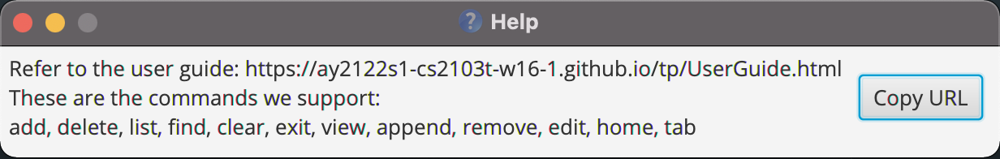
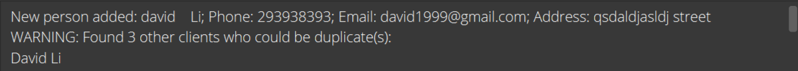
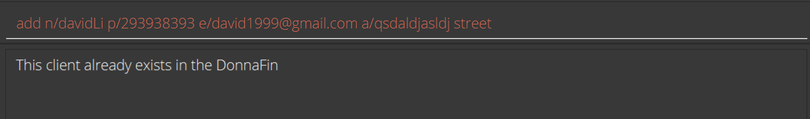
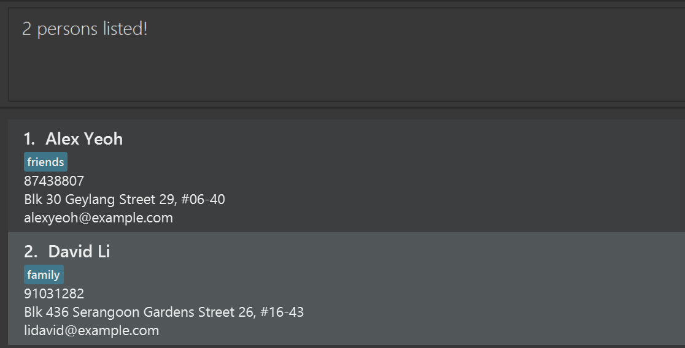
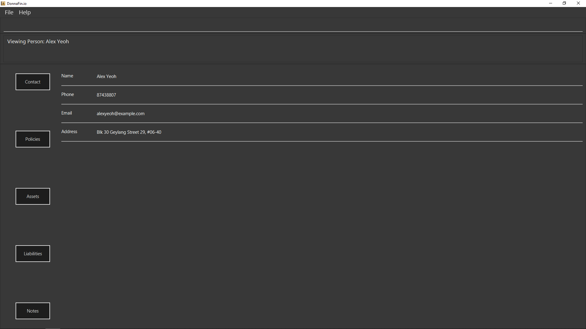

* Table of Contents
{:toc}

--------------------------------------------------------------------------------------------------------------------
## 1. Introduction


DonnaFin.io is a desktop application used by financial advisors to keep track of their
client information and related tasks. The '.io' in our name is a reflection of our belief 
that you deserve a faster workflow for input and output. If you can type fast, 
you can use our [CLI-like](#7-glossary) commands to manage your client information 
and view your notes much faster than your typical customer relationship manager apps.

Note: From here on we shall refer to DonnaFin.io as DonnaFin for your readability.

### 1.1 Is this guide for you?

Are you a new user who is looking to get started with using DonnaFin? Perhaps you are a more 
advanced user trying to refresh your understanding of the available commands? Look no further!
This is the guide that will kickstart your journey as a DonnaFin whizz and even be your go-to
reference if you need to refresh your understanding on some features. 
Head over to [Quick Start](#2-quick-start) or [Features](#4-features) for more information.

### 1.2 How to use the user guide

As most applications on the market are not CLI-based, this may come across 
as new to some users. We strongly recommend that first-time users read through the user guide to gain a basic understanding
of how to use our app. We have also included links to navigate around the user guide to allow easier access
of related information. Some tips and tricks, as well as cautions are included throughout the guide to
help you get more out of our application. Additionally, links back to the top of the page
like below are present at the end of every section. For easier navigation around this User Guide, we suggest using our table of contents together with these 
links to quickly find and access the information you need.

This marks the end of the introduction. Click
<a href="#top">here</a> to return to the top:
--------------------------------------------------------------------------------------------------------------------

## 2. Quick start

1. Ensure you have Java `11` or above installed in your Computer.

1. Download the latest `donnafin.jar` from [here](https://github.com/AY2122S1-CS2103T-W16-1/tp/releases).

1. Copy the file to the folder you want to use as the _home folder_ for your DonnaFin app.

1. Double-click the file to start the app. The GUI similar to the below should appear in a few seconds. Note that DonnaFin comes with some sample clients.<br>
   

1. Type the command in the command box and press Enter to execute it. e.g. typing **`help`** and pressing Enter will open the help window.<br>
   Some example commands you can try:

   * **`list`** : Lists all contacts.

   * **`add`**`n/John Doe p/98765432 e/johnd@example.com a/John street, block 123, #01-01` : Adds a client named `John Doe` to the DonnaFin.

   * **`view`**`3` : Opens the client window, where you can access the details of the 3rd client shown in the current list.
   
   * **`tab`**`a` : Access the assets tab of client that is currently viewed.
   
   * **`append`**`n/Good Class Bungalow ty/Property v/$10000000 r/newly bought with bank loan` : 
   As we are in the Asset tab now, this will add an asset to the currently viewed client.
   * **`remove`**`1` : Removes the 1st asset in the Asset tab.
   
   * **`home`** : Return to home window.
   
   * **`delete`**`3` : Deletes the 3rd client shown in the current list.

   * **`clear`** : Deletes all clients.

   * **`exit`** : Exits the DonnaFin.

1. Refer to the [Features](#4-features) below for details of each command.

This marks the end of the quick start. Click 
<a href="#top">here</a> to return to the top:
--------------------------------------------------------------------------------------------------------------------

## 3. About

### 3.1 Special Icons

### 3.2 Application Home Window Breakdown

### 3.3 Client Explanation

### 3.4 Application Client Window Breakdown

### 3.5 Command Format

<div markdown="block" class="alert alert-info">

**:information_source: Notes about the command format:**<br>

* Command word is **case-insensitive**.<br>
  e.g. in `remove 3`, command word `remove` can be accepted as `Remove` or `rEmOvE`.

* Words in `UPPER_CASE` are the parameters to be supplied by the user.<br>
  e.g. in `edit n/NAME`, `NAME` is a parameter which can be used as `edit n/John Doe`.

* Parameters can be in any order.<br>
  e.g. if the command specifies `n/NAME p/PHONE_NUMBER`, `p/PHONE_NUMBER n/NAME` is also acceptable.

* Items in square brackets are optional.<br>
  e.g. `KEYWORD [MORE_KEYWORDS]` can be used as `KEYWORD MORE_KEYWORDS` or as `KEYWORD`.

* If a parameter is expected only once in the command but you specified it multiple times, only the last occurrence of the parameter will be taken.<br>
  e.g. if you specify `p/12341234 p/56785678`, only `p/56785678` will be taken.

* The format given for monetary parameters includes `$`, you should add it or the input will be rejected. <br>
  e.g. A valid input for `v/$ASSET_VALUE` is `v/$1000`. `v/1000` will not be accepted by DonnaFin.
</div>
L
This marks the end of the about section. Click 
<a href="#top">here</a> to return to the top:
--------------------------------------------------------------------------------------------------------------------

## 4. Features

This section gives you a detailed explanation on how each of our features work.

For your easy reference and navigation, we have split our features into 3 different categories:
1. Global Features
2. Home Window Features
3. Client Window Features
4. Database Features

The following categories will explain the intended purpose of our features.

### 4.1 Global
Global commands consists of features that can be accessed from any (Home or Client) window of DonnaFin.
Such features include getting help and exiting DonnaFin.

#### 4.1.1 Viewing help : `help`

Shows a message explaining how to access the help page.



Format: `help`

#### 4.1.2 Exiting the program : `exit`

Exits the program.

Format: `exit`

### 4.2 Home Window

Home Window commands consists of features that enables you to manage your client base.
These features are exclusive to Home Window, the default window that pops up when DonnaFin is opened.

Such features include adding and deleting clients, listing/clearing all clients, doing a specific search for clients,
as well as viewing a client in detail.

To access and update details on a specific client, refer to [Client Window Commands](#43-client-window).

#### 4.2.1 Adding a Client : `add`

Adds a client to the DonnaFin.

Format: `add n/NAME p/PHONE_NUMBER e/EMAIL a/ADDRESS`

Examples:
* `add n/John Doe p/98765432 e/johnd@example.com a/John street, block 123, #01-01`
* `add n/Betsy Crowe e/betsycrowe@example.com a/Newgate Prison p/1234567`

Do take note that there is a near duplicate check for names. This means that when 
adding a person whose name is similar to another client already found in DonnaFin, 
the result display will prompt the user as such but the client will still be added to 
the contact list. However, if the names are exact duplicates they will be rejected.

Near duplicate:


Duplicate:


Names are said to be near duplicates if the names differs only in case 
(upper case letters where there are lower case letters) or 
with spaces (user types in two or more spaces in place of one)

| First Name     | Second Name                        | Is near duplicate
| -------------- | ---------------------------------------| -------------------------------------------------------------------------------------------------- |
| david Li     | David LI                        | yes
| daviD Li     | David LI                        | yes
| daVid Li     | David LI                        | yes
| david Li     | David    &nbsp; LI                        | yes
| david Li     | David     &nbsp;  &nbsp; &nbsp;     LI              | yes
| davidLi     | David Li                        | no
| DavidLi     | David Li                        | no

Note that this duplicate detection does not try to combine separated words. 
E.g. 'John Son' and 'Johnson' would not be seen as near duplicates.

#### 4.2.2 Deleting a Client : `delete`

Deletes the specified client from the DonnaFin.

Format: `delete INDEX`

* Deletes the client at the specified `INDEX`.
* The index refers to the index number shown in the displayed client list.
* The index **must be a positive integer** 1, 2, 3, …​

Examples:
* `list` followed by `delete 2` deletes the 2nd client in the DonnaFin.
* `find Betsy` followed by `delete 1` deletes the 1st client in the results of the `find` command.

#### 4.2.3 Listing All Clients : `list`

Shows a list of all clients in the DonnaFin.

Format: `list`

#### 4.2.4 Locating Clients by Name: `find`

Finds clients whose names contain any of the given keywords.

Format: `find KEYWORD [MORE_KEYWORDS]`

* The search is case-insensitive. e.g `hans` will match `Hans`
* The order of the keywords does not matter. e.g. `Hans Bo` will match `Bo Hans`
* Only the name is searched.
* Only full words will be matched e.g. `Han` will not match `Hans`
* Persons matching at least one keyword will be returned (i.e. `OR` search).
  e.g. `Hans Bo` will return `Hans Gruber`, `Bo Yang`

Examples:
* `find John` returns `john` and `John Doe`
* `find alex david` returns `Alex Yeoh`, `David Li`<br>
  

#### 4.2.5 View Client Information : `view`

Allows you to open the client window to access all data on your specific chosen client. Once in this window, you can see each client field in detail and edit existing information.
You may refer to our [Client Window Commands](#43-client-window) to learn more about what you can do after executing `view`.

Format: `view INDEX`

* Edits the client at the specified INDEX. The index refers to the index number shown in the displayed person list. 
* The index **must be a positive integer** 1, 2, 3, ...​
* The view screen will switch to the client window.

Examples:
* `view 1`
* This will open a new view mode, where the client's data is present in field-value pairs as such:
* 
* The information related to the client is separated to different tabs.
* Each tab contains information closely related to the title of the tab.

#### 4.2.6 Clearing all client data : `clear`

Clears all data from the DonnaFin.

Format: `clear`


### 4.3 Client Window

Client Window commands consists of features that enables you to manage data on each specific client.
These features are exclusive to Client Window. They give access and writing privileges for any client information
fields. You can access these commands once you have entered the Client Window using our [view command](#425-view-client-information--view).

Such features include switching tabs, editing contact information, managing financial details, as well
as notes for each client.

#### 4.3.1 Switching Tabs In Client Window: `tab`

Allows you to navigate to a different tab. 

There are 5 tabs: 
1. [Contacts](#4311-contacts-tab)
2. [Policies](#4312-policies-tab)
3. [Assets](#4313-assets-tab)
4. [Liabilities](#4314-liabilities-tab)
5. [Notes](#4315-notes-tab)

Format: `tab KEYWORD`

##### 4.3.1.1 Contacts Tab

Switches you from any tab in Client Window to `Contact` tab.

Keywords: `c`, `contact` or `contacts` (case-insensitive)

Examples:
* `tab c`
* `tab contact`

##### 4.3.1.2 Policies Tab

Switches you from any tab in Client Window to `Policies` tab.

Keywords: `p`, `policy` or `policies` (case-insensitive)

Examples:
* `tab p`
* `tab policy`

##### 4.3.1.3 Assets Tab

Switches you from any tab in Client Window to `Assets` tab.

Keywords: `a`, `asset` or `assets` (case-insensitive)

Examples:
* `tab a`
* `tab asset`

##### 4.3.1.4 Liabilities Tab

Switches you from any tab in Client Window to `Liabilities` tab.

Keywords: `l`, `liability` or `liabilities` (case-insensitive)

Examples:
* `tab l`
* `tab liability`

##### 4.3.1.5 Notes Tab

Switches you from any tab in Client Window to `Notes` tab.

Keywords:  `n`, or `note` or `notes` (case-insensitive)

Examples:
* `tab n`
* `tab note`

#### 4.3.2 Edit Client's Contact Information: `edit`

You can edit your client's contact fields with our `edit` command. You should be in `Contacts` tab to use these commands.

Format: `edit [n/NAME] [p/PHONE_NUMBER] [a/ADDRESS] [e/EMAIL]`

* We support multi-field update, you may edit more than one contact field at once.
* `edit` requires at least one field present to be valid.

Example: `edit n/Allison Wang e/allison@plpgp.com`

Below is a breakdown of how you can edit each contact field.

##### 4.3.2.1 Edit Client's Name

You can edit the name of the client you are currently viewing with our `edit` command.

Format: `edit n/NAME`

* This action will override client's current name.

Example: `edit n/Allison Wang`

##### 4.3.2.2 Edit Client's Phone Number

You can edit the phone number of the client you are currently viewing with our `edit` command.

Format: `edit p/PHONE_NUMBER`

* This action will override client's current phone number.

Example: `edit p/81753076`

##### 4.3.2.3 Edit Client's Address

You can edit the address of the client you are currently viewing with our `edit` command.

Format: `edit a/ADDRESS`

* This action will override client's current address.

Example: `edit a/#12-123 Phua Chu Kang Ave 7`

##### 4.3.2.4 Edit Client's Email

You can edit the email of the client you are currently viewing with our `edit` command.

Format: `edit e/EMAIL`

* This action will override client's current email.

Example: `edit e/allison@gmail.com`

#### 4.3.3 Asset Features

Asset Features consists of features that enables you to add and remove assets
for your clients. You must be in the `Assets` tab for these functions to work as intended.

##### 4.3.3.1 Add an Asset to a Client: `append`

Adds a new asset to the current client you are viewing.

* `$ASSET_VALUE` is a monetary value. DonnaFin will only accept whole numbers and
  values in 2 decimal places (i.e. $120 and $120.20 are valid. $120.2 is invalid).

Format: `append n/ASSET_NAME ty/ASSET_TYPE v/$ASSET_VALUE r/REMARKS_ON_ASSET`

Example:
* `append n/Good Class Bungalow ty/Property v/$10000000 r/newly bought with bank loan`

##### 4.3.3.2 Remove an Asset from a Client: `remove`

Remove an existing asset from the current client you are viewing.

* Removes the asset at the specified `INDEX`.
* The index refers to the index number shown in the displayed asset list.
* The index **must be a positive integer** 1, 2, 3, …​

Format: `remove INDEX`

Example:
* `remove 1`

#### 4.3.4 Liability Features

Liability Features consists of features that enables you to add and remove liabilities
for your clients. You must be in the `Liabilities` tab for these functions to work as intended.

##### 4.3.4.1 Add a Liability to a Client: `append`

Adds a new liability to the current client you are viewing.

* `$LIABILITY_VALUE` is a monetary value. DonnaFin will only accept whole numbers and
  values in 2 decimal places (i.e. $120 and $120.20 are valid. $120.2 is invalid).

Format: `append n/LIABILITY_NAME ty/LIABILITY_TYPE v/$LIABILITY_VALUE r/REMARKS_ON_LIABILITY`

Example:
* `append n/Property debt with DBS ty/debt v/$100000 r/10% annual interest`

##### 4.3.4.2 Remove a Liability from a Client: `remove`

Remove an existing liability from the current client you are viewing.

* Removes the liability at the specified `INDEX`.
* The index refers to the index number shown in the displayed liability list.
* The index **must be a positive integer** 1, 2, 3, …​

Format: `remove INDEX`

Example:
* `remove 1`

#### 4.3.5 Policy Features

Policy Features consists of features that enables you to add and remove policies
for your clients. You must be in the `Policies` tab for these functions to work as intended.

##### 4.3.5.1 Add a Policy to a Client: `append`

Adds a new policy to the current client you are viewing. You must be in the `Policies` tab.

* `$INSURED_VALUE`, `$YEARLY_PREMIUM` and `$COMMISSION` are monetary values. DonnaFin will only accept whole numbers and
values in 2 decimal places (i.e. $120 and $120.20 are valid. $120.2 is invalid).

Format: `append n/POLICY_NAME i/INSURER iv/$INSURED_VALUE pr/$YEARLY_PREMIUM c/$COMMISSION`

Example:
* `append n/Diamond Policy i/AIA iv/$10000 pr/$200 c/$1000`

##### 4.3.5.2 Remove a Policy from a Client: `remove`

Remove an existing policy from the current client you are viewing. You must be in the `Policies` tab.

* Removes the liability at the specified `INDEX`.
* The index refers to the index number shown in the displayed policy list.
* The index **must be a positive integer** 1, 2, 3, …​

Format: `remove INDEX`

Example:
* `remove 1`

#### 4.3.6 Edit Notes

You can simply add your changes inside the notes field inside `Notes` tab and DonnaFin will automatically save your data.

#### 4.3.7 Returning to Home Window: `home`

Allows the user to return to the home window.

Format: `home`

### 4.4 Database

Database features consist of features that are related to how your client data is stored.

#### 4.4.1 Saving the data

DonnaFin data are saved in the hard disk automatically after any command that changes the data. There is no need to save manually.

#### 4.4.2 Editing the data file

DonnaFin's data is saved as a JSON file `[JAR file location]/data/donnafin.json`. Advanced users are welcome to update data directly by editing that data file.

<div markdown="block" class="alert alert-warning">:exclamation: **Caution:**

If your changes to the data file makes its format invalid, DonnaFin will discard all data and start with 
an empty data file at the next run.

``` YAML
{
  "persons" : [ {
    "name" : "Alex Yeoh",
    "phone" : "87438807",
    "email" : "alexyeoh@example.com",
    "address" : "Blk 30 Geylang Street 29, #06-40",
    "notes" : "Likes bread",
    "policies" : [ {
      "name" : "Golden Age",
      "insurer" : "AIA",
      "totalValueInsured" : "  14000.00", // note the invalid monetary format
      "yearlyPremiums" : "$ 28.00",
      "commission" : "$ 4.00"
    } ],
  } ]
}
```

The above figure shows the original JSON data for totalValueInsured
regarding the client Alex Yeoh. If you tamper with the 
JSON file directly and change one of the attributes to an invalid format (in this case the 
total value of assets is supposed to be prefixed with a $ to indicate that it is a monetary value), DonnaFin will
discard all the data and start with an empty data file.

When this happens however, to prevent total loss of your data, **we do not delete it right away**.
Only when **any** valid command is run, DonnaFin will assume that the intended action is to clear your data. 
DonnaFin will then proceed to cleanly wipe donnafin.json and execute your command.

</div>

This marks the end of the features section. Click
<a href="#top">here</a> to return to the top:
--------------------------------------------------------------------------------------------------------------------

## 5. FAQ

**Q**: How do I transfer my data to another Computer?<br>
**A**: Install the app in the other computer and overwrite the empty data file it creates with the file that contains the data of your previous DonnaFin home folder.

**Q**: I have multiple clients with the same name, but your application won't let me add them! What do I do?<br>
**A**: We realise some names are common, but we decided to prioritise your ability to instantly recognise a client over letting you keep the accuracy of the name. For that reason, we suggest adding other identifying nicknames or words in the name e.g. "John Walker (Bartender)" and "John Walker (Johnny)".

**Q**: My clients have assets and policies valued in USD / RMB / AUD / other currency. How can I show this in the table?<br>
**A**: We plan to have multi-currency support in future developments. However, currently we only accept dollar ('$') currencies and formats that are compatible with the Singapore Dollar. For now, please use only a single currency and convert as appropriate.

**Q**: I want to write with non-latin alphabets. Do you have support for internationalization (e.g. Chinese, Hindi, Malay)<br>
**A**: While it may not break our system, we have developed this application with latin script in mind, and cannot guarantee a bug-free experience.

This marks the end of the FAQ section. Click 
<a href="#top">here</a> to return to the top:
--------------------------------------------------------------------------------------------------------------------

## 6. Command summary

This section gives a quick summary of how you may use DonnaFin.

| Global Commands     | Format                                                                | Examples
| ---------- | --------------------------------------------------------------------- | -------------------------------------------------------------------------------------------------- |
| **Help**   | `help`                                                                 | `help`
| **Exit**   | `exit`                                                                 | `exit`

| Home Window Commands     | Format                                                                | Examples
| ---------- | --------------------------------------------------------------------- | -------------------------------------------------------------------------------------------------- |
| **Add**    | `add n/NAME p/PHONE_NUMBER e/EMAIL a/ADDRESS`                | `add n/James Ho p/22224444 e/jamesho@example.com a/123, Clementi Rd, 1234665`
| **Delete** | `delete`                                                               | `delete 3`
| **Find**   | `find KEYWORD`                                                         | `find James Jake`
| **List**   | `list`                                                                 | `list`
| **View Client Window**   | `view INDEX`                                                                 | `view 1`
| **Clear**  | `clear`                                                                | `clear`

| Client Window Commands     | Format                                                                | Examples
| ---------- | --------------------------------------------------------------------- | -------------------------------------------------------------------------------------------------- |
| **Return to Home Window**   | `home`                                                                 | `home`
| **Switch to Contacts Tab**   | `tab KEYWORD`                                                                 | `tab c`
| **Switch to Policies Tab**   | `tab KEYWORD`                                                                 | `tab p`
| **Switch to Assets Tab**   | `tab KEYWORD`                                                                 | `tab a`
| **Switch to Liabilities Tab**   | `tab KEYWORD`                                                                 | `tab l`
| **Switch to Notes Tab**   | `tab KEYWORD`                                                                 | `tab n`
| **Edit Name**   | `edit n/NAME` | `edit n/James Lee`
| **Edit Address**   | `edit a/ADDRESS` | `edit a/blk 123 bukit batok ave 4`
| **Edit Email**   | `edit e/EMAIL` | `edit e/jameslee@donnafin.com`
| **Edit Phone Number**   | `edit p/PHONE_NUMBER` | `edit p/98374283`
| **Add Asset**   | `append n/ASSET_NAME ty/ASSET_TYPE v/$ASSET_VALUE r/REMARKS_ON_ASSET`| `append n/Good Class Bungalow ty/Property v/$10000000 r/newly bought with bank loan`
| **Add Liability**   | `append n/LIABILITY_NAME ty/LIABILITY_TYPE v/$LIABILITY_VALUE r/REMARKS_ON_LIABILITY`| `append n/Property debt with DBS ty/debt v/$100000 r/10% annual interest`
| **Add Policy**   | `append n/POLICY_NAME i/INSURER iv/$INSURED_VALUE pr/$YEARLY_PREMIUM c/$COMMISSION`| `append n/Diamond Policy i/AIA iv/$10000 pr/$200 c/$1000`
| **Remove Asset/Liability/Policy**   | `remove INDEX`                                                                 | `remove 1`


This marks the end of the command summary section. Click 
<a href="#top">here</a> to return to the top:
--------------------------------------------------------------------------------------------------------------------

## 7. Glossary

* **CLI**: Abbreviation for command line interface, where commands are processed in the form of text
as opposed to graphical user interfaces(mouse-based applications).
* **Asset**: Items that generate profit or return on investment.
* **Liability**: Obligations that require payments from the client.
* **Policy**: A contract between an insurer and policyholder (the client in this case) where the policy holder receives 
financial protection or reimbursement against losses.

This marks the end of the glossary. Click 
<a href="#top">here</a> to return to the top:
--------------------------------------------------------------------------------------------------------------------
